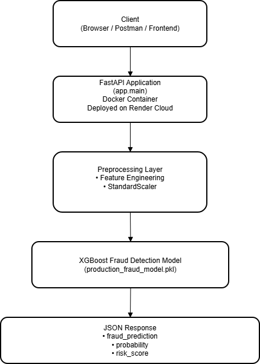

# 🚀 Fraud Detection System – Real-Time ML API

🔗 **Live API:**  
https://fraud-detection-system-vd1n.onrender.com  

📄 **Swagger Docs:**  
https://fraud-detection-system-vd1n.onrender.com/docs  

---

## 📖 Overview

This project is a production-ready Fraud Detection Machine Learning API built using FastAPI and deployed with Docker on Render.

The system performs real-time fraud prediction on financial transactions using an XGBoost classification model.

---

## 🏗 System Architecture



---

## 🛠 Tech Stack

- Python 3.10
- FastAPI
- XGBoost
- Scikit-learn
- Docker
- Render (Cloud Deployment)

---

## 📦 Project Structure

```
fraud-detection-system/
│
├── app/
├── models/
├── examples/
├── Dockerfile
├── requirements.txt
└── README.md
```

---

## 🔮 API Endpoints

- GET /
- GET /health
- POST /predict
- POST /predict/batch

---

## 📤 Sample Request

See: `examples/sample_request.json`

---

## 🧠 Model

- Algorithm: XGBoost
- Preprocessing: StandardScaler
- Output: Fraud (0 or 1)

---

## 🐳 Deployment

The application is containerized using Docker and deployed on Render.

---

## 📌 Author

Abhinav B Mamidwar  
GitHub: https://github.com/Abhinavmamidwar
